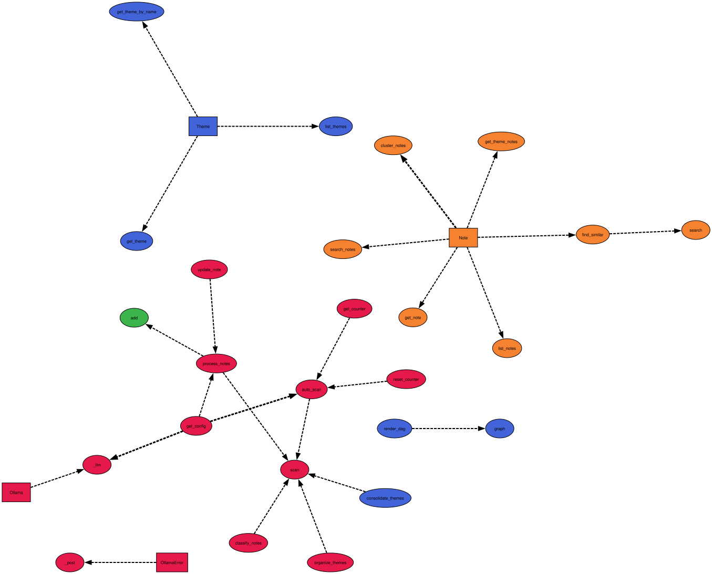

# NoteCast (Python port)

Local note engine that uses an LLM to build and evolve a knowledge graph.
Ollama-first, CLI-only, zero cloud dependencies.

Ported from [AlexWasHeree/NoteCast](https://github.com/AlexWasHeree/NoteCast) (TypeScript/Bun).

## Dependencies

**Python**: `click`, `graphviz` (Python wrapper).  
**System**: [Ollama](https://ollama.com), [Graphviz](https://graphviz.org) (`apt install graphviz` / `brew install graphviz`).  
**Models** (pull once):

```sh
ollama pull llama3.2:1b
ollama pull nomic-embed-text
```

## Install

```sh
uv pip install -e .
```

## What changed from the original

- **No Bun/TypeScript**: pure Python, stdlib where possible.
- **No YAKE**: keywords extracted by the LLM during summarization (one call instead of two).
- **No LanceDB**: vectors stored as JSON in SQLite, cosine similarity in pure Python. Fine for <10k notes.
- **No server**: CLI only, talks directly to SQLite.
- **No .env / API keys**: Ollama at localhost:11434 by default. Config in SQLite via `notecast config set`.
- **FTS5**: full-text search on notes via `notecast search`.
- **`notecast scan --stage auto`**: auto-chains process→classify→organize→consolidate based on thresholds.
- **Graphviz SVG**: `notecast graph` renders the theme DAG.

## Pipeline

```
add note
    │
  pending ─[process]─► processed ─[classify]─► scanned ─[organize]─► organized
                                                                          │
                                                       [consolidate] ◄────┘
                                                             │
                                                        organized (refined DAG)
```

**process**: LLM summarizes + extracts keywords; embedding generated. One call.  
**classify**: Assigns notes to existing themes (1-3 each).  
**organize**: Splits overloaded themes into subtopics.  
**consolidate**: Detects co-occurrence, adds DAG edges, prunes empties. No LLM needed.

## Hotspots


## Usage

```sh
# base themes (need at least one before classifying)
notecast theme add Tech --base
notecast theme add Personal --base
notecast theme add Work --base

# add notes
notecast add my-note.md
notecast add my-note.md --process     # add + immediately process
notecast add-batch ~/notes/ --ext .md,.txt

# pipeline
notecast scan                          # auto-detect what's ready
notecast scan --stage process          # just process pending
notecast scan --stage classify -v      # classify with verbose output

# inspect
notecast status
notecast search "kubernetes"
notecast search "kubernetes" --similar # + semantically similar notes
notecast theme list

# graph
notecast graph                         # → notecast-graph.svg
notecast graph -o my-graph --format png

# config
notecast config get
notecast config set gen_model mistral:7b
notecast config set split_threshold 20

# maintenance
notecast retry-failed
notecast reset                         # soft: re-queue scanned notes
notecast reset --full                  # delete everything
```

## Config

Stored in SQLite. Env override: `NOTECAST_DB` for database path.

| Key                | Default                  | Description                              |
|--------------------|--------------------------|------------------------------------------|
| `ollama_url`       | `http://localhost:11434` | Ollama API base URL                      |
| `gen_model`        | `llama3.2:1b`            | Model for summarization/classification   |
| `embed_model`      | `nomic-embed-text`       | Model for embeddings                     |
| `classify_every`   | `10`                     | Processed notes before auto-classify     |
| `organize_after`   | `2`                      | Classify runs before auto-organize       |
| `consolidate_after`| `3`                      | Organize runs before auto-consolidate    |
| `split_threshold`  | `15`                     | Notes in theme before considering split  |
| `language`         | `english`                | Language for LLM prompts                 |
| `context`          | (empty)                  | Domain context injected into prompts     |

## License

MIT
